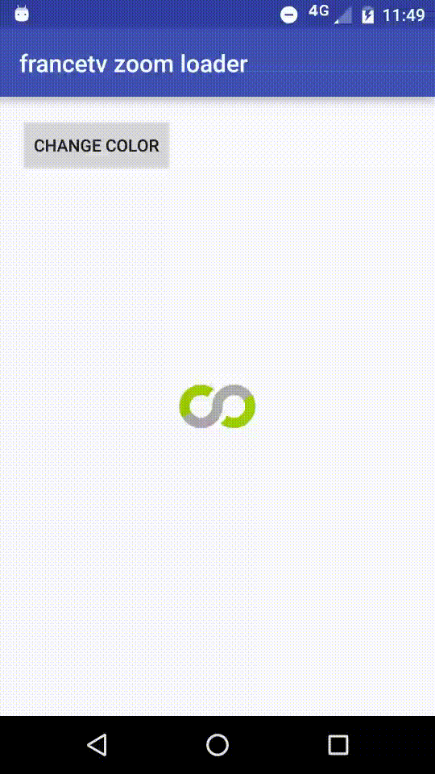

# francetv zoom Loader View #

This project is part of [francetv zoom open source projects](https://github.com/francetv/zoom-public) (iOS, Android and Angular).

Angular module to make popin easily. It provide a service to build popin with a basic style.



## How to ##

#### Copy files in your project ####

From /lib directory, copy ZoomLoaderView.java and img_loader_mask.png in your project java package and resources /drawable-xhdmi directory.

#### Add in your layout ####

```xml
    <fr.francetv.zoom.share.loader.ZoomLoaderView
        android:id="@+id/loader"
        android:layout_width="wrap_content"
        android:layout_height="wrap_content"/>
```

#### In your activity ####


```java
    private ZoomLoaderView mLoader;

    @Override
    protected void onCreate(Bundle savedInstanceState) {
        super.onCreate(savedInstanceState);
        setContentView(R.layout.activity_main);

        mLoader = (ZoomLoaderView)findViewById(R.id.loader);
    }

    @Override
    protected void onResume() {
        super.onResume();
        mLoader.start();
    }

    @Override
    protected void onPause() {
        mLoader.stop();
        super.onPause();
    }
```

#### Change color ####

```java
    mLoader.setThemeColor(ContextCompat.getColor(getApplicationContext(), android.R.color.holo_purple));
```


#### License ####

```java
/*
 * The MIT License (MIT)
 *
 * Copyright (c) 2016 France Télévisions
 *
 * Permission is hereby granted, free of charge, to any person obtaining a copy of this software and associated
 * documentation files (the "Software"), to deal in the Software without restriction, including without limitation
 * the rights to use, copy, modify, merge, publish, distribute, sublicense, and/or sell copies of the Software, and
 * to permit persons to whom the Software is furnished to do so, subject to the following conditions:
 *
 * The above copyright notice and this permission notice shall be included in all copies or substantial portions of
 * the Software.
 *
 * THE SOFTWARE IS PROVIDED "AS IS", WITHOUT WARRANTY OF ANY KIND, EXPRESS OR IMPLIED, INCLUDING BUT NOT LIMITED TO
 * THE WARRANTIES OF MERCHANTABILITY, FITNESS FOR A PARTICULAR PURPOSE AND NONINFRINGEMENT. IN NO EVENT SHALL THE
 * AUTHORS OR COPYRIGHT HOLDERS BE LIABLE FOR ANY CLAIM, DAMAGES OR OTHER LIABILITY, WHETHER IN AN ACTION OF CONTRACT,
 * TORT OR OTHERWISE, ARISING FROM, OUT OF OR IN CONNECTION WITH THE SOFTWARE OR THE USE OR OTHER DEALINGS IN THE
 * SOFTWARE.
 */
 ```
